### The safer alternative to Smart skin : The design and fabrication of piezoresistive trackpad to simulate “touch” for bionic limbs and robot parts

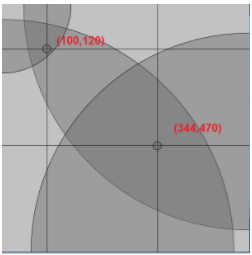

Table of Contents :

[Introduction](#h.fcsnkn2dcsnl)        [6](#h.fcsnkn2dcsnl)

[Motivation : Alternative to the conventional rigid
trackpad](#h.d5asg9wm8qm3)        [7](#h.d5asg9wm8qm3)

[Goals and Objectives :](#h.kfccgiq4z3ls)        [10](#h.kfccgiq4z3ls)

[Overview](#h.yluz5q671yed)        [10](#h.yluz5q671yed)

[Hypothesis](#h.nptmeuz615t5)        [11](#h.nptmeuz615t5)

[Software Development](#h.4soinpeyx4ga)        [13](#h.4soinpeyx4ga)

[Location sensing using
Trilateration](#h.6yd06evs0tky)        [15](#h.6yd06evs0tky)

[Mathematics behind
trilateration](#h.ot8on441259m)        [17](#h.ot8on441259m)

[Instrumentation](#h.e2mslpy8f7kx)        [20](#h.e2mslpy8f7kx)

[Experiment & Process](#h.stdim9a84lxg)        [23](#h.stdim9a84lxg)

[Plot 1 : Intersection of
circles](#h.ggb3tt7y1if)        [23](#h.ggb3tt7y1if)

[Plot 2 : X, Y coordinate
location](#h.4ilnbiy3wosr)        [24](#h.4ilnbiy3wosr)

[Graph analysis](#h.5zw4gcw1tg1y)        [24](#h.5zw4gcw1tg1y)

[Accuracy Calculation](#h.pky9txs0njjs)        [25](#h.pky9txs0njjs)

[Disconformity
calculations](#h.qh1hbrg1kanv)        [26](#h.qh1hbrg1kanv)

[Conclusion](#h.wsg23tmwvv1w)        [27](#h.wsg23tmwvv1w)

[Future Direction](#h.2fwkvofk8iin)        [28](#h.2fwkvofk8iin)

Abstract {#h.kcbmtv7yj4cz .c30}
========

The safer alternative to Smart skin : The design and fabrication of
piezoresistive trackpad to simulate “touch” for bionic limbs and robot
parts

 

Aman Adhav                               

Currently, Smart skin technologies are primarily being used as sensors
and to control devices. However, using Smart skin technology is
problematic: the metals and chemicals used in Smart skins can enter the
bloodstream, potentially leading to major health problems such as metal
poisoning, Alzheimer's disease, and cancer. This project presents the
design and fabrication of a piezoresistive flexible surface for
quantifying “touch” on surfaces such as the human skin. The
piezoresistive fabric is a transducer that senses touch and pressure.
Results show, the signals from the surface can be converted into
Euclidean coordinates using a multilateration algorithm. As an
illustration of the concept, were initialized and programmed to control
radio frequency devices when touched.

Introduction {#h.fcsnkn2dcsnl .c12}
============

The purpose of this project is to describe the development, fabrication
and validation of a novel piezoresistive fabric flexible surface for the
purpose of detecting and quantifying touch. This was accomplished with a
piezoresistive fabric that conforms to curved surfaces. Recognizing
“touch” on curved surfaces can cause problems with signals as the fabric
can transduce pressure.

Currently, Smartskin technologies are primarily being used as sensors
and to control devices. However, using Smartskin technology is
problematic: the metals and chemicals used in Smartskins can enter the
bloodstream, potentially leading to major health problems such as metal
poisoning, Alzheimer's disease, and cancer (Edwards, 2014). This project
uses Piezoelectric fabric as a transducer to sense touch and pressure
and convert those signals into locations on a screen. It presents
location sensing technologies that can be used to control radio
frequency & bluetooth devices.

Motivation : Alternative to the conventional rigid trackpad {#h.d5asg9wm8qm3 .c17}
-----------------------------------------------------------

The conventional 4-wire resistive touchscreens consist of two top
transparent glass or acrylic panels and a bottom transparent insulating
panel. Both top panels are coated with electrically conductive layers.
These layers have uniform resistance made from indium tin oxide (ITO).
The panels are separated by invisible non-conducting spacers.

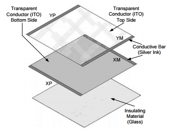

The top layer panel is flexible and the bottom layer panel is rigid.
Pressing the flexible top sheet creates an electrical contact between
the resistive layers, essentially closing a switch in the circuit. The
four electrical wires are connected to conductive bars.
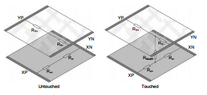

As illustrated in the diagram, touch is calculated by finding the
resistance on the two plates. This system has been proven very effective
however, a solution can be found by implementing a simpler method
(Cheng, Tsao,Lai, & Yang, 2011; Lemerle et al., 2008).

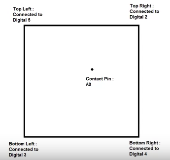 

Figure (A) : Graphical representation of the connections with
Piezoresistive fabric   

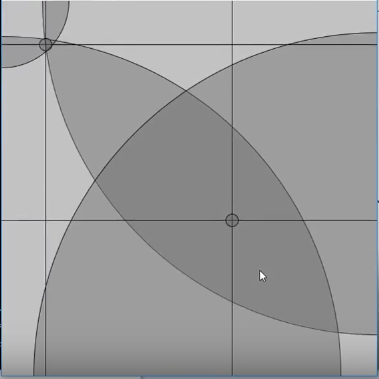

Figure (B) : Representation of location finding using Piezoresistive
fabric

The following figures illustrate how the values are being interpreted in
the arduino. The locations that are calculated in this proposal are
using a trilateration algorithm. Trilateration is a geolocation concept
that uses radii of circles and their areas in order to determine
coordinates. By using the ADC (Analog to digital converted) values,
locations can be determined by calculating the intersection of circles
as shown in Figure (B).

In conclusion, the project uses a simpler method to calculate the
location coordinates than conventional resistive trackpads (Aldien,
Welcome, Rakheja, Dong, & Boileau, 2004; Hoozemans & van Dieën, 2005;
Welcome, Rakheja, Dong, Wu, & Schopper, 2004)

.

There is a significant difference in costs for the production of a
resistive touchpad, which can be reduced using the algorithms and method
implemented in this project. The piezoresistive fabrics are cheap to
manufacture and safe to use. This cost efficient method is safer and far
superior than any Smart skin.

Goals and Objectives : {#h.kfccgiq4z3ls .c17}
----------------------

The ultimate goal of this project is to create a new technology that can
potentially revolutionize the wearables and bionics industries. Smart
wearables can help the disabled control radio frequency devices by using
the fabric as a location tracking sensor. This work encompasses the
following objectives :

-   Design a circuit that receives values that can quantify hand forces
    on any surfaces.
-   Create an algorithm that can convert analog values to Euclidean
    coordinates.
-   Control radio frequency operated devices with touch pad.

Overview {#h.yluz5q671yed .c17}
--------

Smart skin technology as a whole is very invasive as it requires to be
imprinted on the skin. Unlike the piezoresistive fabrics, metals inside
Smart skins can be lethal. A solution for this problem could be a non
invasive transducer, that can quantify hand forces into coordinates. An
attempt by University of British Colombia’s professor Dr. John Madden,
created a transparent pressure matrix that can be used to sense touch at
different locations. However the complexity of the project made it
unfeasible option as the pressure matrix are only 3 cm X 3 cm (Madden,
2014). The project was also very expensive and required complex
compounds that made the project difficult to scale.

Pressure matrix or trackpads have always been used for location
tracking. They are better than Smart skins yet they cannot conform due
to their structure. Piezoresistive fabrics have conductive properties
that allow them to be stretched and conformed. They also make great
pressure sensors as they consist of silicon and carbon compounds. With
these properties in play, it is possible to achieve location tracking on
a large scale using these fabrics (Antony & Keir, 2010; Brookham, Wong,
& Dickerson, 2010; Sporrong, Palmerud, & Herberts, 1996).

.

In this project, the experiments that will be conducted study the
properties the properties of piezoresistive fabrics and their
effectiveness in order to achieve location tracking.

Hypothesis {#h.nptmeuz615t5 .c12}
==========

If the pressure of the hand force on the fabric increases, then the
analog values increase because adding pressure causes there to be more
resistance added, causing deformations and effecting the output analog
values greatly.

In order to interpret values from the piezoresistive fabric, the analog
values must be converted to digital values. The analog values range from
0V to 5V. These values need to be mapped from 0 to 1023 in order to
achieve the theoretical range (Burström & Lundström, 2011).

A test must be conducted with the fabric in order to linearize the
values that are being interpreted. To do so, Voltages are calculated at
diagonally, from Vcc to GND.

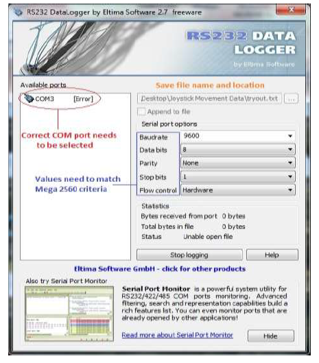

Figure 1: Main window of data logging program used (RS232 Data Logger™)

Software Development {#h.4soinpeyx4ga .c12}
====================

A program called Data Logger was used to find analog voltages using an
Arduino UNO. The data received from the microcontroller. Once captured
by the data logging software, the data must be calibrated by choosing
every 10th value at a 5 ms intervals. This is accomplished with the use
of the spreadsheet program Microsoft™ Excel.

To illustrate this example the following diagram is drawn. Voltage
values are collected by connecting analog read sensels to each of the
points on the grid as shown in the figure below. These values are then
added to excel in the spreadsheet and graphed accordingly.

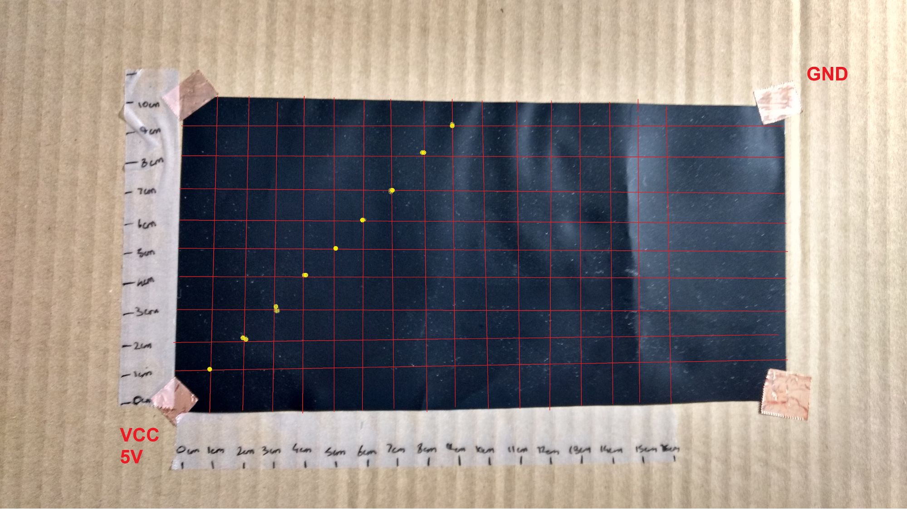

Figure 2 : Diagram illustrates the locations where data was collected.

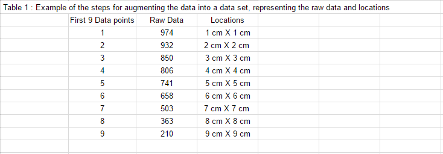

Table 1 : Example of the steps for augmenting the data into datasets,
representing the raw data and locations

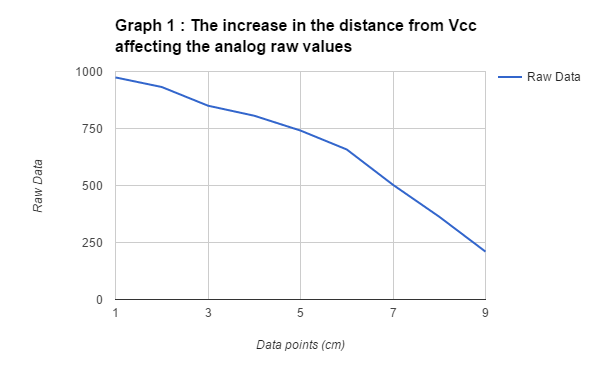

Conclusion :

As the distance from Vcc increases, the resistance drastically changes.
As seen in the graph, the points correlate very closely with a
logarithmic graph (Bao & Silverstein, 2005; Duque, Masset, & Malchaire,
1995).

The devised formula for the sensel pins is (Kuijt-Evers et al., 2007) :

:

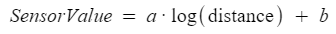

Where a and b are constants that can help derive an equation for the
sensor values.

This can be an effective solution to deriving for calculating the
Euclidean coordinates, however due to constant changes in pressure,
temperature and stretch, the equation is not universal and would require
a calibration algorithm.

Location sensing using Trilateration {#h.6yd06evs0tky .c12}
====================================

The method implemented to find Euclidean coordinates is called
trilateration. Trilateration as a concept uses radii and centroids of
the circle to form an intersection. This intersection has an area that
can be defined by a coordinates. Trilateration is commonly used in
Geography instead of Triangulation; which requires angles and distances
to calculate the coordinates (Lau, 2011).

Figure 3 : Diagram illustrates coordinate location finding using
trilateration using intersection points (McAtamney & Nigel Corlett,
1993).

In the project, trilateration as a concept was used with four circles in
order to create 2 intersection areas and points.

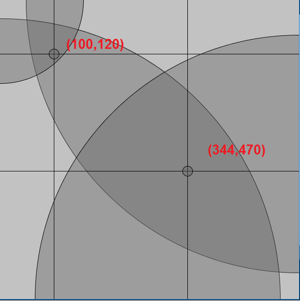

Figure 4 : Coordinates representing the intersection of two regions 

The figure show how using trilateration the intersection of the of the 4
circles is found. In order to determine the exact contact specific
locations of the coordinates, the project uses a comparison algorithm
that find the sensel pin with the smallest raw value and compares the
result to the two intersections.

Mathematics behind trilateration {#h.ot8on441259m .c17}
--------------------------------

To compute the trilateration, 3 circles with known radii and coordinate
location of their centres is required. To define these parameters, the
radii will be the digitally converted values from the Analog To Digital
converter. In the program, the parameters for the length and height of
the screen are set for (600,600). Respectively the coordinates of each
circle would be : (600,0), (600,600), (0,0), (0,600).

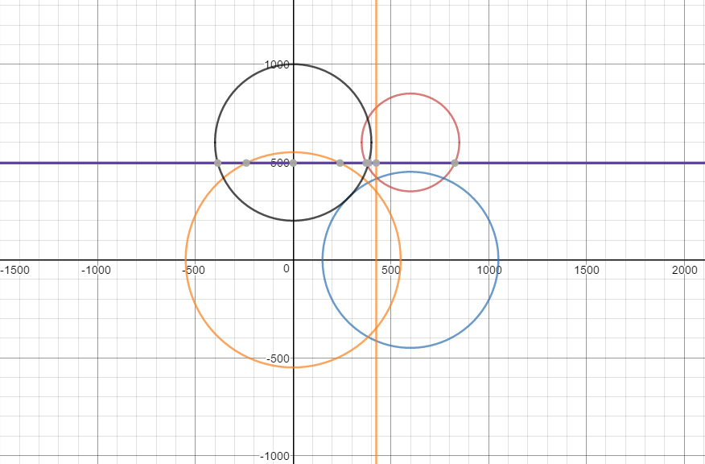

Graph 2 : Geometric representation of Euclidean coordinate location
using trilateration (created in Desmos)

Graph showing layout of the circles and the points and the intersection
points. In order to determine the equations for the coordinates (Takala
et al., 2010) :

1.  Finding the intersection of three of the four circles by finding the
    radii and the location of the center points.
2.  The three unknown circles and their points being x,y,z.
3.  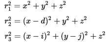
4.  Using the following equations, where r1 r2 r3 are the radii of the
    respected circles. ‘d’ is the location of the second circle and
    (i,j) are the coordinates of the third circle.
5.  A system of equations can be formulated using these equations in
    order to create a universal equation for the x and y values.
6.  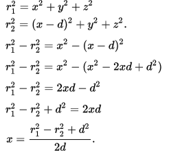
7.  As shown in the system of equations, y and z are eliminated leaving
    a very simple solution for x.
8.  After substituting x back into one of the equation, a solution for y
    can be achieved.
9.  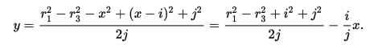
10. Steps 1-9 are repeated in order to calculate the intersection for
    the 4th circle. The 3rd circle needs to be replaced in the steps.

In the process shown above, equations for the x and y coordinates can be
calculated. The trilateration algorithm in this project uses the same
method in order to find the x and y coordinates (Webster, 1999).

Instrumentation {#h.e2mslpy8f7kx .c17}
---------------

This section describes the equipment used to collect data and analyze
the data obtained.

Arduino Uno R3 :

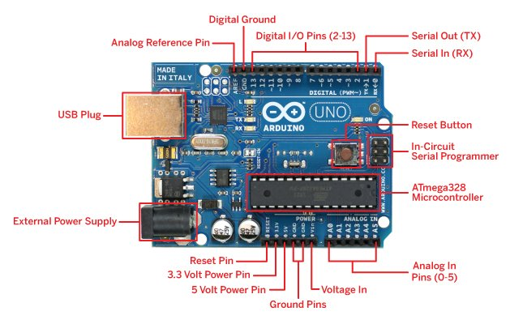

Figure 5 : Representation of the Arduino Uno R3 pinout and board layout
(Adafruit, 2011)

The Arduino uno is a microcontroller board with 14v digital Input/Output
pins, 6 analog inputs, 16MHz quartz crystal, a USB connection a power
input and a rest button (Adafruit, 2011).

 Analog input A0, digital pins 2 - 5 and GND were the only pins used in
this project. The analog input pin was the sensor pin that established
contact with the fabric when touched. The digital pins 2-5 were
connected to corners of the fabric (Gautschi, 2006). These pins supplied
voltage to the corners of the fabric. Pull up resistors were used to
ensure that inputs to the arduino settle at expected logic levels if
external devices are disconnected or there is high-impedance (Spielholz
et al., 2008).

Pull-up resistors attached between the piezoresistive fabric and the
Arduino were used to establish a controlled current flow from the
Arduino to the fabric and act as a voltage divider which permitted the
sensitivity of the fabric to be changed externally. 780Ω resistors were
used based on the fact that they act as pull-up resistor (Eltaib &
Hewit, 2003).

.

Circuit diagram and layout :

 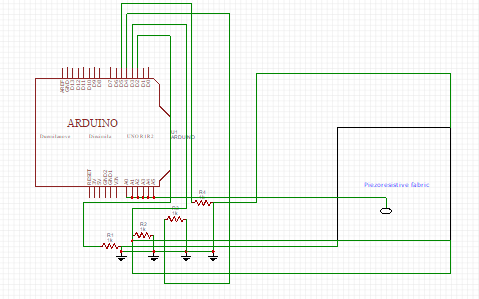

Figure 5 : Schematic of the pull-up circuitry used for connecting the
sensor to the Arduino™

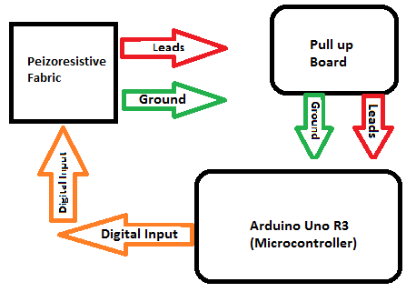

Figure 6 : Flowchart of the electrical circuit

The pull-up circuitry is connected between the sensor and
microcontroller. Once the signal has passed the pull-up circuit, the
microcontroller (VIN) reads and stores the data through pin A0, which
can be modelled by the following relationship, where the value (VRN ) of
is the voltage across the pull-up resistor (Min-Hang Bao, 2000):

Equation :

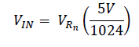

Experiment & Process {#h.stdim9a84lxg .c12}
====================

In order for location tracking to occur, at each end of the
piezoelectric fabric a 5V (high) voltage needs to be applied. Location
tracking occurs when 3 of the 4 sensels are high while the 4th one is
low. However the sensels alternate and switch roles every 1 ms. An
example would be [Sensel 1 (low), sensel 2,3,4 (high)], [Sensel 2 (low),
sensel 1,3,4 (high)]. What is printed out in the arduino serial monitor
is a series of analogread values between 0 - 1023. If values such as
1023 are outputted by the A0 pin, then it is safe to assume the pin is
touching one of the 4 corners. This raw data is then further refined by
choosing every 10th term at a 5 ms interval.

In order to calculate locations using this data, the serial port of the
arduino is synced with a software called Processing 3.0, it uses java
8.0 however has many inbuilt functions that can help create graphs and
animation. In Processing the raw data values are scaled to fit inside a
(600,600) area by using the map function. Once converted the data is
then plotted.

Plot 1 : Intersection of circles {#h.ggb3tt7y1if .c17}
--------------------------------

This particular plot is effectively used to visualize trilateration and
intersection of the circles. In this plot, in order to find the values a
special trilateration function is written.  The data from the each
sensel is used as the radius for a circle. This function is used to
calculate the coordinates of two points based on alternating between
sensel 3 and 4. The coordinates are found by calculating finding the
sensel which has the smallest value (from raw data indicating the
radius).

Plot 2 : X, Y coordinate location {#h.4ilnbiy3wosr .c17}
---------------------------------

In order to generate graph of the X, Y coordinate, the values computed
from the trilateration algorithm are then converted to data points that
needs to be graphed.

Graph analysis {#h.5zw4gcw1tg1y .c17}
--------------

In order to determine the effectiveness of the piezoresistive fabric,
disconformities need to be taken into consideration and how their
changes affect the coordinate system. To calculate the disconformities,
the piezoresistive fabric is mounted on curved surfaces with increasing
heights.

To compute the accuracy of the data, the sensel pin A0 is secured to
multiple points on the piezoresistive fabric. This will help determine
the accuracy and effectiveness of the piezoresistive fabric.

### Accuracy Calculation {#h.pky9txs0njjs .c24}

The accuracy of data points can be computed and found out using the
following.

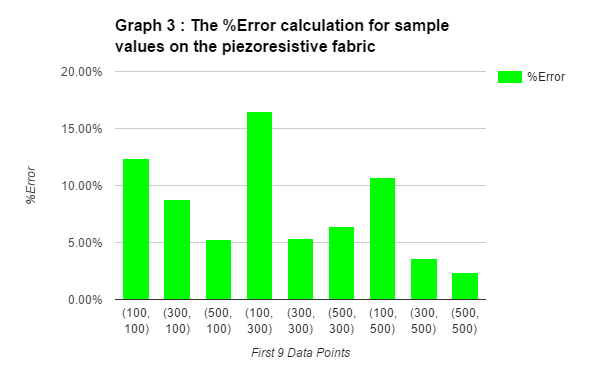

Graph 3 illustrates the percentage errors for a sample of 9 points on
the piezoresistive sensor. The quantified percentage error is the
average of all the 9 errors. In data logger, every 10th value was used
to find the coordinates at a 5 ms interval. In total there is a 7.48%
error.

Refer to Table 4 in the appendix for data points and values.

### Disconformity calculations {#h.qh1hbrg1kanv .c24}

In order to determine the effectiveness of the piezoresistive fabric,
disconformities need to be taken into consideration and how their
changes affect the coordinate system. To calculate the disconformities,
the piezoresistive fabric is mounted on curved surfaces with increasing
heights.

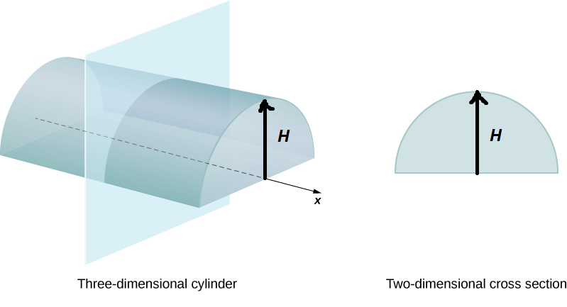

Figure 6 : Illustrates the change in height of a curved surface from 1
cm - 10 cm 

To compute the accuracy of the data, the sensel pin A0 is secured to
multiple points on the piezoresistive fabric. On average, increase in
the bend per cm, increases the percentage error of

the calculations by 2.46% for X values and 3.94% for Y values.

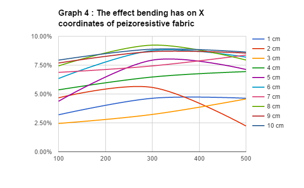

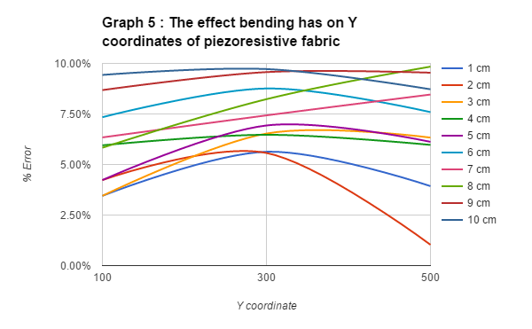

Conclusion {#h.wsg23tmwvv1w .c12}
==========

As it stands now, using piezoresistive fabrics is definitely a safer
alternative to Smart skins that have metals and chemicals which can be
lethal to the human body. As proven in the project, piezoresistive
fabrics are used as transducers to quantify Euclidean coordinates using
trilateration. The applications of location sensing are vast: From
virtual keyboards to radio frequency device control, this project has
proven piezoresistive fabrics are a revolutionary the wearable
technology.

Future Direction {#h.2fwkvofk8iin .c12}
================

In future testing and comparing different piezoresistive fabrics to be
used in applications such as: Gesture Recognition to help the impaired.

For further improvements to this project, the use of calibration
algorithms and noise filtration circuits can help reduce the average
percentage error in the circuits.  

In addition to gesture recognition, pressure sensing technologies can
help aid bionic/robot arms analyze pressure sensitivity and implement an
algorithm regarding this.

